# Create New Functionality Plan

## Overview
This plan outlines the implementation of "Create New" functionality for all 13 dashboard menus in the RSHP UNAIR application. The implementation will follow the existing edit functionality pattern.

## Dashboard Menus to Update

| # | Menu | Model | Controller | Primary Key |
|---|------|-------|------------|-------------|
| 1 | Jenis Hewan | JenisHewan | JenisHewanController | idjenis_hewan |
| 2 | Ras Hewan | RasHewan | RasHewanController | idras_hewan |
| 3 | Kategori | Kategori | KategoriController | idkategori |
| 4 | Kategori Klinis | KategoriKlinis | KategoriKlinisController | idkategori_klinis |
| 5 | Tindakan Terapi | KodeTindakanTerapi | TindakanTerapiController | idkode_tindakan_terapi |
| 6 | Rekam Medis | RekamMedis | RekamMedisController | idrekam_medis |
| 7 | Temu Dokter | TemuDokter | TemuDokterController | idreservasi_dokter |
| 8 | Pet | Pet | PetController | idpet |
| 9 | Pemilik | Pemilik | PemilikController | idpemilik |
| 10 | Role | Role | RoleController | idrole |
| 11 | User | User | UserController | iduser |
| 12 | Perawat | Perawat | PerawatController | id_perawat |
| 13 | Dokter | Dokter | DokterController | id_dokter |

---

## Implementation Steps

### Step 1: Update Routes
Add `create` and `store` routes for each menu in [`routes/dashboard.php`](routes/dashboard.php).

**Pattern:**
```php
Route::get('/create', [Controller::class, 'create'])->name('route-name.create');
Route::post('/', [Controller::class, 'store'])->name('route-name.store');
```

**Example for Jenis Hewan:**
```php
Route::prefix('jenis-hewan')->group(function () {
    Route::get('/', [JenisHewanController::class, 'index'])->name('jenis-hewan.index');
    Route::get('/create', [JenisHewanController::class, 'create'])->name('jenis-hewan.create');
    Route::post('/', [JenisHewanController::class, 'store'])->name('jenis-hewan.store');
    Route::get('/{id}/edit', [JenisHewanController::class, 'edit'])->name('jenis-hewan.edit');
    Route::put('/{id}', [JenisHewanController::class, 'update'])->name('jenis-hewan.update');
})->middleware('auth');
```

---

### Step 2: Update DataTable Component

#### 2.1 Update [`app/View/Components/DataTable.php`](app/View/Components/DataTable.php)
Add a new property for create route:
```php
public $createRoute;

public function __construct($tableData = [], $model = null, $idField = 'id', $editRoute = null, $createRoute = null)
{
    $this->tableData = $tableData;
    $this->model = $model;
    $this->idField = $idField;
    $this->editRoute = $editRoute;
    $this->createRoute = $createRoute;
}
```

#### 2.2 Update [`resources/views/components/data-table.blade.php`](resources/views/components/data-table.blade.php)
Add a "Create New" button header section:
```blade
<div class="p-4 border-b border-gray-200 flex justify-between items-center">
    <h2 class="text-lg font-semibold text-gray-800">Data Table</h2>
    @if($createRoute)
        <a href="{{ route($createRoute) }}" class="px-4 py-2 text-sm font-medium text-white bg-cyan-600 rounded-lg hover:bg-cyan-700 transition-colors">
            <i class="fas fa-plus mr-2"></i>
            Tambah Baru
        </a>
    @endif
</div>
```

---

### Step 3: Update Controllers

For each controller, add `create()` and `store()` methods following these patterns:

#### Simple Controllers Pattern
For: JenisHewan, Kategori, KategoriKlinis, Role

```php
public function create()
{
    return view('dashboard.menu_name.create');
}

public function store(Request $request)
{
    $request->validate([
        'field_name' => 'required|string|max:255',
    ]);

    Model::create($request->all());

    return redirect()->route('route-name.index')->with('success', 'Data berhasil ditambahkan.');
}
```

#### Controllers with Relations Pattern
For: RasHewan, Pet, TindakanTerapi, TemuDokter, RekamMedis

```php
public function create()
{
    $relatedData = RelatedModel::all();
    return view('dashboard.menu_name.create', compact('relatedData'));
}

public function store(Request $request)
{
    $request->validate([
        'field' => 'required',
        'foreign_key' => 'required|exists:table,column',
    ]);

    Model::create($request->all());

    return redirect()->route('route-name.index')->with('success', 'Data berhasil ditambahkan.');
}
```

#### Controllers with User Relationship Pattern
For: Pemilik, Dokter, Perawat

```php
public function create()
{
    $users = User::all();
    return view('dashboard.menu_name.create', compact('users'));
}

public function store(Request $request)
{
    $request->validate([
        'nama' => 'required|string|max:255',
        'email' => 'required|email|unique:user,email',
        'password' => 'required|string|min:8',
        // other fields
    ]);

    // Create User first
    $user = User::create([
        'nama' => $request->nama,
        'email' => $request->email,
        'password' => Hash::make($request->password),
    ]);

    // Create related entity
    Entity::create([
        'iduser' => $user->iduser,
        // other fields
    ]);

    return redirect()->route('route-name.index')->with('success', 'Data berhasil ditambahkan.');
}
```

#### Special Case: User Controller
```php
public function create()
{
    $roles = Role::all();
    return view('dashboard.user.create', compact('roles'));
}

public function store(Request $request)
{
    $request->validate([
        'nama' => 'required|string|max:255',
        'email' => 'required|email|unique:user,email',
        'password' => 'required|string|min:8',
        'roles' => 'required|array',
        'roles.*' => 'exists:role,idrole',
    ]);

    $user = User::create([
        'nama' => $request->nama,
        'email' => $request->email,
        'password' => Hash::make($request->password),
    ]);

    $user->role()->attach($request->roles);

    return redirect()->route('user.index')->with('success', 'User berhasil ditambahkan.');
}
```

---

### Step 4: Create View Files

Create `create.blade.php` for each menu based on the corresponding `edit.blade.php` template.

**Key differences from edit views:**
1. Title: "Create X" instead of "Edit X"
2. Form action: `route('route-name.store')` instead of `route('route-name.update', $id)`
3. Method: `POST` instead of `PUT`
4. No `@method('PUT')` directive
5. No pre-filled values from existing model
6. Button text: "Simpan" instead of "Simpan Perubahan"

**Template Structure:**
```blade
@extends('layouts.dashboard')

@section('title', 'Create Entity - RSHP UNAIR')

@section('content')
<div class="max-w-xl mx-auto">
    <div class="mb-6 flex items-center justify-between">
        <div>
            <h1 class="text-2xl font-bold text-gray-800">Create Entity</h1>
            <p class="text-gray-600">Add new entity data.</p>
        </div>
        <a href="{{ route('route-name.index') }}" class="flex items-center text-sm text-gray-500 hover:text-gray-700 transition-colors">
            <i class="fas fa-arrow-left mr-2"></i>
            Kembali ke Daftar
        </a>
    </div>

    <div class="bg-white rounded-xl shadow-sm border border-gray-200 overflow-hidden">
        <form action="{{ route('route-name.store') }}" method="POST" class="p-6 space-y-4">
            @csrf

            <!-- Form fields here -->

            <div class="pt-4 flex justify-end space-x-3">
                <a href="{{ route('route-name.index') }}" 
                    class="px-4 py-2 text-sm font-medium text-gray-700 bg-white border border-gray-300 rounded-lg hover:bg-gray-50 transition-colors">
                    Batal
                </a>
                <button type="submit" 
                    class="px-4 py-2 text-sm font-medium text-white bg-cyan-600 rounded-lg hover:bg-cyan-700 focus:ring-4 focus:ring-cyan-200 transition-colors">
                    Simpan
                </button>
            </div>
        </form>
    </div>
</div>
@endsection
```

---

### Step 5: Update Table Views

Update each `table.blade.php` to pass the `createRoute` parameter to the data-table component:

```blade
<x-data-table 
    :table-data="App\Models\Model::all()->toArray()"
    model="Model" 
    id-field="id_field"
    edit-route="route-name.edit"
    create-route="route-name.create" />
```

---

## Detailed Controller Specifications

### 1. JenisHewanController
- **Fields:** `nama_jenis_hewan`
- **Validation:** `required|string|max:255`

### 2. RasHewanController
- **Fields:** `nama_ras`, `idjenis_hewan`
- **Needs:** JenisHewan data for dropdown
- **Validation:** `nama_ras` required, `idjenis_hewan` exists

### 3. KategoriController
- **Fields:** `nama_kategori`
- **Validation:** `required|string|max:255`

### 4. KategoriKlinisController
- **Fields:** `nama_kategori_klinis`
- **Validation:** `required|string|max:255`

### 5. TindakanTerapiController
- **Fields:** `kode`, `deskripsi_tindakan_terapi`, `idkategori`, `idkategori_klinis`
- **Needs:** Kategori and KategoriKlinis data for dropdowns

### 6. RekamMedisController
- **Fields:** `anamnesa`, `temuan_klinis`, `diagnosa`, `idpet`, `dokter_pemeriksa`, `details` array
- **Needs:** Pet and Dokter data for dropdowns
- **Special:** Handle detail rekam medis creation

### 7. TemuDokterController
- **Fields:** `status`, `idpet`, `idrole_user`
- **Needs:** Pet and Dokter data for dropdowns
- **Special:** Auto-generate `no_urut` and `waktu_daftar`

### 8. PetController
- **Fields:** `nama`, `tanggal_lahir`, `warna_tanda`, `jenis_kelamin`, `idpemilik`, `idras_hewan`
- **Needs:** Pemilik and RasHewan data for dropdowns

### 9. PemilikController
- **Fields:** User fields (`nama`, `email`, `password`) + `no_wa`, `alamat`
- **Special:** Create User first, then Pemilik

### 10. RoleController
- **Fields:** `nama_role`
- **Validation:** `required|string|max:255|unique:role,nama_role`

### 11. UserController
- **Fields:** `nama`, `email`, `password`, `roles`
- **Needs:** Role data for multi-select
- **Special:** Hash password, sync roles

### 12. PerawatController
- **Fields:** User fields + `pendidikan`, `alamat`, `no_hp`, `jenis_kelamin`
- **Special:** Create User first, then Perawat

### 13. DokterController
- **Fields:** User fields + `bidang_dokter`, `alamat`, `no_hp`, `jenis_kelamin`
- **Special:** Create User first, then Dokter

---

## Files to Create/Modify Summary

### Routes
- [`routes/dashboard.php`](routes/dashboard.php) - Add create/store routes

### Components
- [`app/View/Components/DataTable.php`](app/View/Components/DataTable.php) - Add createRoute property
- [`resources/views/components/data-table.blade.php`](resources/views/components/data-table.blade.php) - Add create button

### Controllers (add create/store methods)
1. [`app/Http/Controllers/JenisHewanController.php`](app/Http/Controllers/JenisHewanController.php)
2. [`app/Http/Controllers/RasHewanController.php`](app/Http/Controllers/RasHewanController.php)
3. [`app/Http/Controllers/KategoriController.php`](app/Http/Controllers/KategoriController.php)
4. [`app/Http/Controllers/KategoriKlinisController.php`](app/Http/Controllers/KategoriKlinisController.php)
5. [`app/Http/Controllers/TindakanTerapiController.php`](app/Http/Controllers/TindakanTerapiController.php)
6. [`app/Http/Controllers/RekamMedisController.php`](app/Http/Controllers/RekamMedisController.php)
7. [`app/Http/Controllers/TemuDokterController.php`](app/Http/Controllers/TemuDokterController.php)
8. [`app/Http/Controllers/PetController.php`](app/Http/Controllers/PetController.php)
9. [`app/Http/Controllers/PemilikController.php`](app/Http/Controllers/PemilikController.php)
10. [`app/Http/Controllers/RoleController.php`](app/Http/Controllers/RoleController.php)
11. [`app/Http/Controllers/UserController.php`](app/Http/Controllers/UserController.php)
12. [`app/Http/Controllers/PerawatController.php`](app/Http/Controllers/PerawatController.php)
13. [`app/Http/Controllers/DokterController.php`](app/Http/Controllers/DokterController.php)

### Views to Create
1. `resources/views/dashboard/jenis_hewan/create.blade.php`
2. `resources/views/dashboard/ras_hewan/create.blade.php`
3. `resources/views/dashboard/kategori/create.blade.php`
4. `resources/views/dashboard/kategori_klinis/create.blade.php`
5. `resources/views/dashboard/tindakan_terapi/create.blade.php`
6. `resources/views/dashboard/rekam_medis/create.blade.php`
7. `resources/views/dashboard/temu_dokter/create.blade.php`
8. `resources/views/dashboard/pet/create.blade.php`
9. `resources/views/dashboard/pemilik/create.blade.php`
10. `resources/views/dashboard/role/create.blade.php`
11. `resources/views/dashboard/user/create.blade.php`
12. `resources/views/dashboard/perawat/create.blade.php`
13. `resources/views/dashboard/dokter/create.blade.php`

### Views to Update (add create-route parameter)
1. [`resources/views/dashboard/jenis_hewan/table.blade.php`](resources/views/dashboard/jenis_hewan/table.blade.php)
2. [`resources/views/dashboard/ras_hewan/table.blade.php`](resources/views/dashboard/ras_hewan/table.blade.php)
3. [`resources/views/dashboard/kategori/table.blade.php`](resources/views/dashboard/kategori/table.blade.php)
4. [`resources/views/dashboard/kategori_klinis/table.blade.php`](resources/views/dashboard/kategori_klinis/table.blade.php)
5. [`resources/views/dashboard/tindakan_terapi/table.blade.php`](resources/views/dashboard/tindakan_terapi/table.blade.php)
6. [`resources/views/dashboard/rekam_medis/table.blade.php`](resources/views/dashboard/rekam_medis/table.blade.php)
7. [`resources/views/dashboard/temu_dokter/table.blade.php`](resources/views/dashboard/temu_dokter/table.blade.php)
8. [`resources/views/dashboard/pet/table.blade.php`](resources/views/dashboard/pet/table.blade.php)
9. [`resources/views/dashboard/pemilik/table.blade.php`](resources/views/dashboard/pemilik/table.blade.php)
10. [`resources/views/dashboard/role/table.blade.php`](resources/views/dashboard/role/table.blade.php)
11. [`resources/views/dashboard/user/table.blade.php`](resources/views/dashboard/user/table.blade.php)
12. [`resources/views/dashboard/perawat/table.blade.php`](resources/views/dashboard/perawat/table.blade.php)
13. [`resources/views/dashboard/dokter/table.blade.php`](resources/views/dashboard/dokter/table.blade.php)

---

## Architecture Diagram

```mermaid
flowchart TB
    subgraph Routes
        R[dashboard.php]
    end

    subgraph Controllers
        C1[JenisHewanController]
        C2[RasHewanController]
        C3[KategoriController]
        C4[KategoriKlinisController]
        C5[TindakanTerapiController]
        C6[RekamMedisController]
        C7[TemuDokterController]
        C8[PetController]
        C9[PemilikController]
        C10[RoleController]
        C11[UserController]
        C12[PerawatController]
        C13[DokterController]
    end

    subgraph Views
        V1[jenis_hewan/create.blade.php]
        V2[ras_hewan/create.blade.php]
        V3[kategori/create.blade.php]
        V4[kategori_klinis/create.blade.php]
        V5[tindakan_terapi/create.blade.php]
        V6[rekam_medis/create.blade.php]
        V7[temu_dokter/create.blade.php]
        V8[pet/create.blade.php]
        V9[pemilik/create.blade.php]
        V10[role/create.blade.php]
        V11[user/create.blade.php]
        V12[perawat/create.blade.php]
        V13[dokter/create.blade.php]
    end

    subgraph Components
        DT[DataTable Component]
    end

    R --> C1 & C2 & C3 & C4 & C5 & C6 & C7 & C8 & C9 & C10 & C11 & C12 & C13
    C1 --> V1
    C2 --> V2
    C3 --> V3
    C4 --> V4
    C5 --> V5
    C6 --> V6
    C7 --> V7
    C8 --> V8
    C9 --> V9
    C10 --> V10
    C11 --> V11
    C12 --> V12
    C13 --> V13
    DT -.->|Add Create Button| V1 & V2 & V3 & V4 & V5 & V6 & V7 & V8 & V9 & V10 & V11 & V12 & V13
```



---

## Implementation Order

1. **Foundation First**
   - Update DataTable component (add createRoute support)
   - Update data-table.blade.php (add create button)

2. **Routes**
   - Add all create/store routes to dashboard.php

3. **Simple Controllers & Views** (no relations)
   - JenisHewan
   - Kategori
   - KategoriKlinis
   - Role

4. **Controllers with Single Relation**
   - RasHewan (needs JenisHewan)
   - TindakanTerapi (needs Kategori, KategoriKlinis)

5. **Controllers with Multiple Relations**
   - Pet (needs Pemilik, RasHewan)
   - TemuDokter (needs Pet, Dokter)
   - RekamMedis (needs Pet, Dokter, KodeTindakanTerapi)

6. **Controllers with User Creation**
   - Pemilik
   - Dokter
   - Perawat
   - User (special case with roles)

7. **Update Table Views**
   - Add create-route parameter to all table views